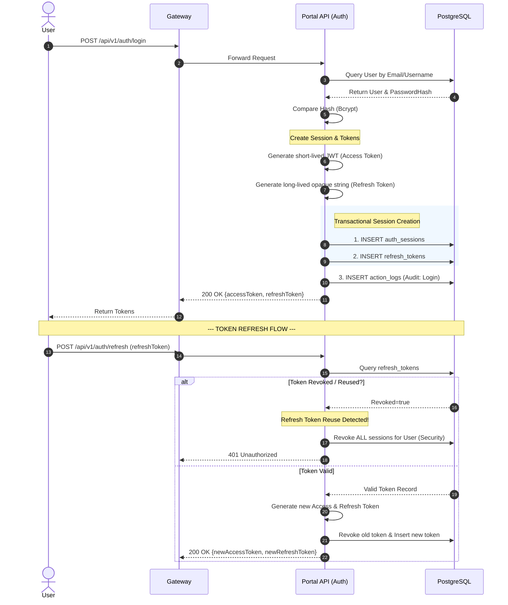

# Authentication & Session Management Flow

This diagram outlines how the system handles user logins, issues JWTs, manages stateful Refresh Tokens in PostgreSQL, and supports session revocation.

```mermaid
sequenceDiagram
    autonumber
    actor User
    participant Gateway
    participant CoreAPI as Portal API (Auth)
    participant DB as PostgreSQL

    User->>Gateway: POST /api/v1/auth/login
    Gateway->>CoreAPI: Forward Request
    
    CoreAPI->>DB: Query User by Email/Username
    DB-->>CoreAPI: Return User & PasswordHash
    
    CoreAPI->>CoreAPI: Compare Hash (Bcrypt)
    
    Note over CoreAPI: Create Session & Tokens
    CoreAPI->>CoreAPI: Generate short-lived JWT (Access Token)
    CoreAPI->>CoreAPI: Generate long-lived opaque string (Refresh Token)
    
    rect rgb(240, 248, 255)
        note right of CoreAPI: Transactional Session Creation
        CoreAPI->>DB: 1. INSERT auth_sessions
        CoreAPI->>DB: 2. INSERT refresh_tokens
    end
    
    CoreAPI->>DB: 3. INSERT action_logs (Audit: Login)
    
    CoreAPI-->>Gateway: 200 OK {accessToken, refreshToken}
    Gateway-->>User: Return Tokens

    %% Token Refresh Flow
    Note over User,DB: --- TOKEN REFRESH FLOW ---
    
    User->>Gateway: POST /api/v1/auth/refresh (refreshToken)
    Gateway->>CoreAPI: 
    CoreAPI->>DB: Query refresh_tokens
    
    alt Token Revoked / Reused?
        DB-->>CoreAPI: Revoked=true
        Note over CoreAPI: Refresh Token Reuse Detected!
        CoreAPI->>DB: Revoke ALL sessions for User (Security)
        CoreAPI-->>Gateway: 401 Unauthorized
    else Token Valid
        DB-->>CoreAPI: Valid Token Record
        CoreAPI->>CoreAPI: Generate new Access & Refresh Token
        CoreAPI->>DB: Revoke old token & Insert new token
        CoreAPI-->>Gateway: 200 OK {newAccessToken, newRefreshToken}
    end
```
