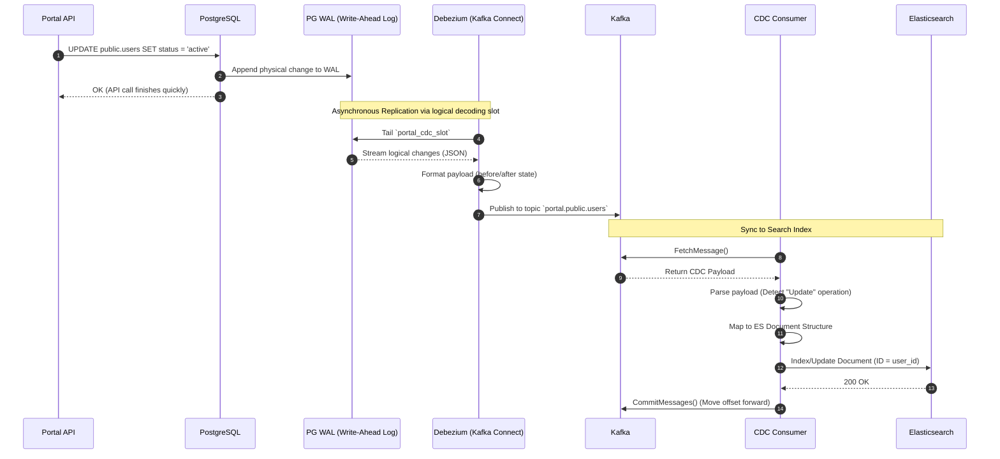

# CDC Search Sync Flow

This diagram shows how changes in the PostgreSQL primary database are asynchronously and automatically synchronized to Elasticsearch using Debezium (Log-Based CDC).

```mermaid
sequenceDiagram
    autonumber
    participant CoreAPI as Portal API
    participant DB as PostgreSQL
    participant WAL as PG WAL (Write-Ahead Log)
    participant Debezium as Debezium (Kafka Connect)
    participant Kafka as Kafka
    participant Consumer as CDC Consumer
    participant ES as Elasticsearch

    CoreAPI->>DB: UPDATE public.users SET status = 'active'
    DB->>WAL: Append physical change to WAL
    DB-->>CoreAPI: OK (API call finishes quickly)
    
    Note over Debezium,WAL: Asynchronous Replication via logical decoding slot
    Debezium->>WAL: Tail `portal_cdc_slot`
    WAL-->>Debezium: Stream logical changes (JSON)
    
    Debezium->>Debezium: Format payload (before/after state)
    Debezium->>Kafka: Publish to topic `portal.public.users`
    
    Note over Kafka,ES: Sync to Search Index
    Consumer->>Kafka: FetchMessage()
    Kafka-->>Consumer: Return CDC Payload
    
    Consumer->>Consumer: Parse payload (Detect "Update" operation)
    Consumer->>Consumer: Map to ES Document Structure
    
    Consumer->>ES: Index/Update Document (ID = user_id)
    ES-->>Consumer: 200 OK
    
    Consumer->>Kafka: CommitMessages() (Move offset forward)
```
