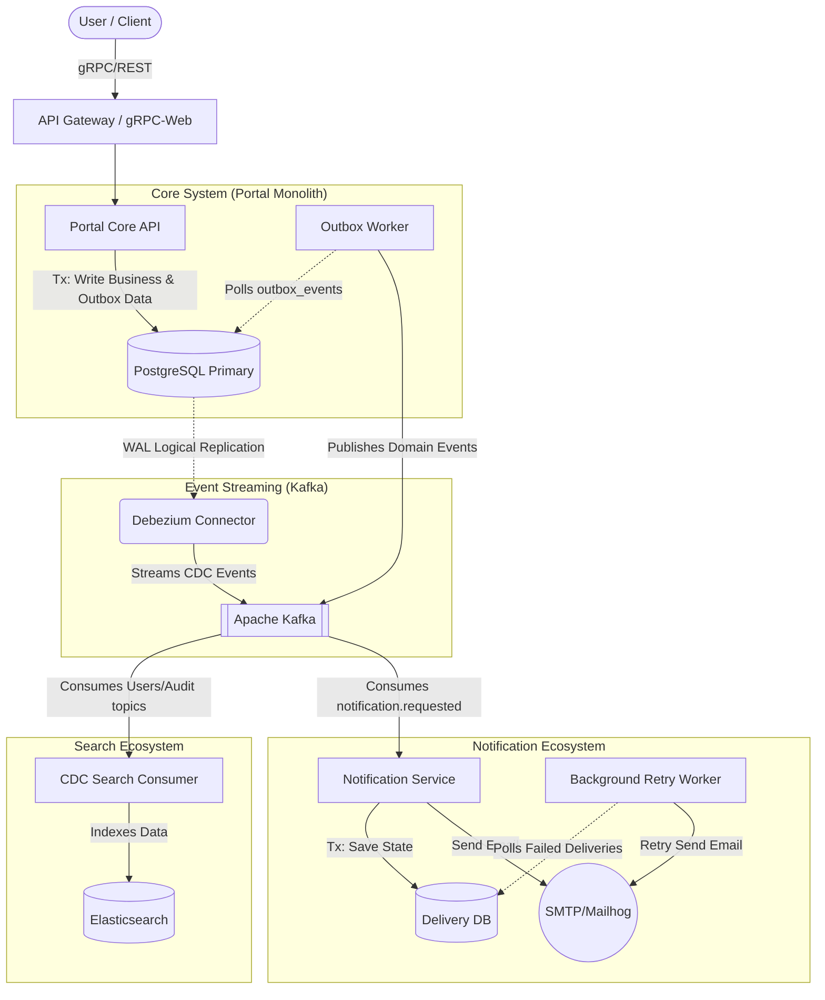

# Macro System Architecture

This diagram illustrates the high-level relationship between the external actors, the API Gateway, the core services, the message broker, and the databases.

```mermaid
graph TD
    %% Actors
    User([User / Client])
    
    %% Gateway
    Gateway[API Gateway / gRPC-Web]
    
    subgraph "Core System (Portal Monolith)"
        CoreAPI[Portal Core API]
        OutboxWorker[Outbox Worker]
        DB[(PostgreSQL Primary)]
    end
    
    subgraph "Event Streaming (Kafka)"
        Broker[[Apache Kafka]]
        Debezium(Debezium Connector)
    end
    
    subgraph "Search Ecosystem"
        CDCConsumer[CDC Search Consumer]
        ES[(Elasticsearch)]
    end
    
    subgraph "Notification Ecosystem"
        NotifService[Notification Service]
        NotifDB[(Delivery DB)]
        RetryWorker[Background Retry Worker]
        SMTP((SMTP/Mailhog))
    end
    
    %% Interactions
    User -->|gRPC/REST| Gateway
    Gateway --> CoreAPI
    
    %% Core DB Flow
    CoreAPI -->|Tx: Write Business & Outbox Data| DB
    OutboxWorker -.->|Polls outbox_events| DB
    OutboxWorker -->|Publishes Domain Events| Broker
    
    %% CDC Flow
    DB -.->|WAL Logical Replication| Debezium
    Debezium -->|Streams CDC Events| Broker
    
    %% Consumers
    Broker -->|Consumes Users/Audit topics| CDCConsumer
    CDCConsumer -->|Indexes Data| ES
    
    Broker -->|Consumes notification.requested| NotifService
    NotifService -->|Tx: Save State| NotifDB
    NotifService -->|Send Email| SMTP
    RetryWorker -.->|Polls Failed Deliveries| NotifDB
    RetryWorker -->|Retry Send Email| SMTP
```
