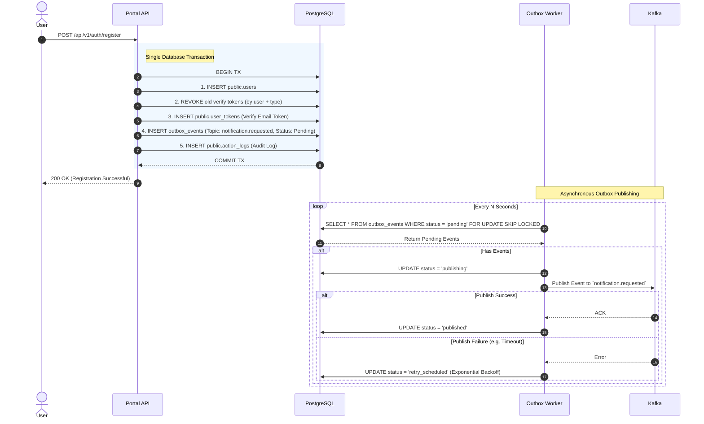

# User Registration & Transactional Outbox Flow

This diagram illustrates how the system ensures Eventual Consistency when creating a user and triggering a welcome/verification email, without the risk of dual-write failures.

